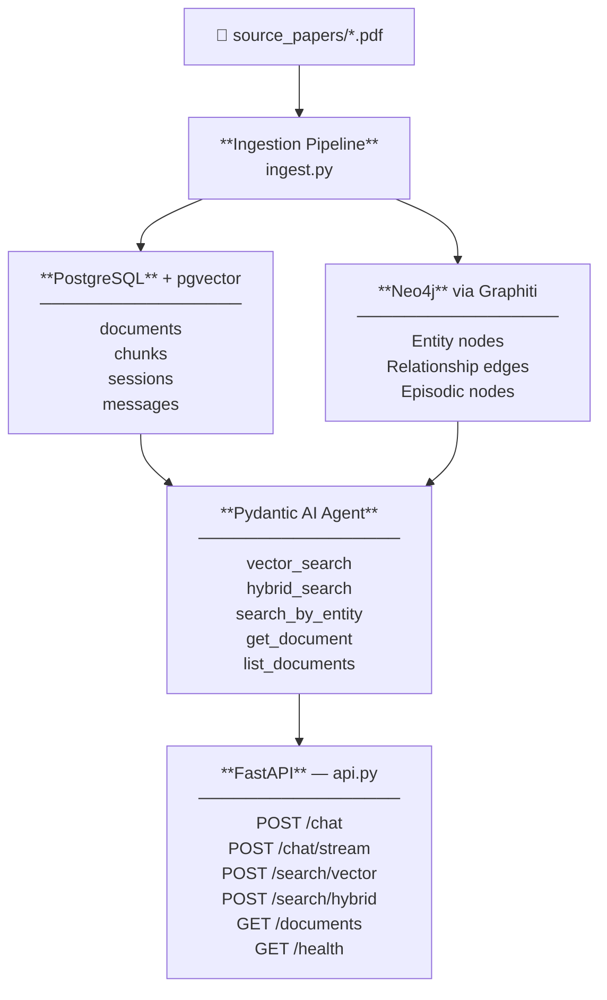

# Technical Documentation

**Version 1**

---

## Contents

- [1. Project Overview](#1-project-overview)
- [2. Getting Started](#2-getting-started)
  - [2.1 System Requirements](#21-system-requirements)
  - [2.2 First-Time Setup](#22-first-time-setup)
  - [2.3 Packages](#23-packages)
- [3. Instruction Guide](#3-instruction-guide)
- [4. Architecture](#4-architecture)
- [Support & Contact](#support--contact)

---

## 1. Project Overview

This system is an Agentic Retrieval-Augmented Generation (RAG) application built specifically for analysing serum-free and xeno-free cell culture research papers. It allows a researcher to ask natural-language questions about cell culture protocols, media formulations, viability outcomes, and supplier information, and receive answers backed by evidence extracted from scientific PDFs. It cites specific papers and DOIs rather than generating answers from general knowledge.

The system retrieves relevant snippets from your PDFs first, then asks the AI to write an answer using only those snippets, which is why it can cite specific papers and DOIs instead of guessing.

### Problem Statement

Serum-free cell culture research is scattered across many papers with inconsistent reporting formats. Manually comparing viability percentages, doubling times, or media brands across a literature corpus is time-consuming. This system indexes the PDFs into two complementary databases and lets an LLM-powered agent retrieve and synthesise the relevant information on demand.

---

## 2. Getting Started

### 2.1 System Requirements

**Operating System**

- Linux (Ubuntu 22.04+ recommended) — for the VM
- Windows/macOS with WSL2 or Remote-SSH also supported

**Hardware**

- RAM: minimum 8 GB (16 GB recommended for qwen2.5:7b)
- Storage: minimum 10 GB free (models + Docker images)
- CPU: 4+ cores recommended

**Software**

- Python 3.10+
- Docker 20.10+
- Git
- Ollama (installed automatically via `setup.sh`)

**Network**

- Internet access required for Neon PostgreSQL (cloud)
- Ports 7474 and 7687 accessible for Neo4j (local)
- Port 11434 accessible for Ollama (local)

---

### 2.2 First-Time Setup

**Prerequisites**

- Python 3.10+
- Docker
- Git
- A Neon PostgreSQL account (cloud)

**Step 1 — Clone the repository**

```bash
git clone <repo-url>
cd ITHD-Project-AI-serum-free-culture
```

**Step 2 — Configure environment variables**

Copy `example.env` to `.env` and fill in your values:

- `DATABASE_URL` — Neon PostgreSQL connection string
- `NEO4J_PASSWORD` — password for Neo4j
- `LLM_CHOICE` — the large language model you want to use
- `LLM_API_KEY` — your API key

**Step 3 — Run the setup script**

```bash
chmod +x setup.sh
./setup.sh
```

This automatically installs:

- Python virtual environment and all dependencies
- PostgreSQL schema on Neon
- Neo4j via Docker
- Ollama with the required models (`nomic-embed-text`, `qwen2.5:7b`)

**Step 4 — Activate the environment**

```bash
source venv/bin/activate
```

---

### 2.3 Packages

**AI Agent**

| Package | Purpose |
|---------|---------|
| `pydantic-ai` | Agent framework used to build and orchestrate the research assistant |
| `openai` | OpenAI-compatible client, used here to connect to Ollama locally |
| `anthropic` | Anthropic SDK for Claude API access |
| `mcp` | Model Context Protocol, enables tool use between the agent and external services |

**Knowledge Graph**

| Package | Purpose |
|---------|---------|
| `graphiti-core` | Builds and queries the temporal knowledge graph on top of Neo4j |
| `neo4j` | Driver for connecting to the Neo4j graph database |

**Database**

| Package | Purpose |
|---------|---------|
| `asyncpg` | Async PostgreSQL driver for connecting to Neon |

**Document Processing**

| Package | Purpose |
|---------|---------|
| `pymupdf` | PDF parsing for ingesting research papers |

**API & Server**

| Package | Purpose |
|---------|---------|
| `fastapi` + `uvicorn` | REST API layer for the application |

**Data Validation**

| Package | Purpose |
|---------|---------|
| `pydantic` | Data models and validation throughout the codebase |

**Testing**

| Package | Purpose |
|---------|---------|
| `pytest` + `pytest-asyncio` | Test suite for async code |

---

## 3. Instruction Guide

### Running the Application

**Step 1 — Activate the environment**

```bash
source venv/bin/activate
```

**Step 2 — Start required services**

```bash
# Check if Docker is running
docker ps

# Start Neo4j if it is not already running
docker start neo4j

# Verify Ollama is running and models are available
ollama list
```

**Step 3 — Ingest documents**

Place your PDF or markdown research papers in the `source_papers/` folder, then run:

```bash
# Basic ingestion (uses source_papers/ by default)
python -m ingestion.ingest

# With verbose logging
python -m ingestion.ingest --verbose

# Skip knowledge graph (if Neo4j is not needed)
python -m ingestion.ingest --no-graph

# Clean existing data before ingesting
python -m ingestion.ingest --clean

# Use a different folder
python -m ingestion.ingest --documents /path/to/your/papers
```

> **Tip — Running ingestion in the background on the VM**
>
> Ingestion can take a long time. Use `screen` to keep it running even if your SSH session drops:
>
> ```bash
> # Start a named screen session
> screen -S ingest
>
> # Run ingestion inside the session
> python -m ingestion.ingest --verbose
>
> # Detach from the session (keeps it running): press Ctrl + A, then D
>
> # List active sessions
> screen -ls
>
> # Reattach to a session
> screen -r ingest
>
> # Close a session completely (from inside it)
> exit
> ```

**Step 4 — Start the API server**

```bash
python -m agent.api
```

**Step 5 — Verify the server is running**

```bash
curl http://localhost:8058/health
```

**Step 6 — Start the CLI chat**

```bash
python cli.py
```

---

### Available API Endpoints

| Method | Endpoint | Description |
|--------|----------|-------------|
| GET | `/health` | Check if the API and database are running |
| POST | `/chat` | Send a question to the agent |
| POST | `/chat/stream` | Streaming response via Server-Sent Events |
| POST | `/search/vector` | Direct vector similarity search |
| POST | `/search/hybrid` | Hybrid search (vector + keyword) |
| GET | `/documents` | List all ingested documents |

### Example Chat Request

```bash
curl -X POST http://localhost:8058/chat \
  -H "Content-Type: application/json" \
  -d '{"message": "What media compositions are used in serum-free culture?"}'
```

---

## 4. Architecture



> **Note:** To render the diagram above, open this file in VS Code and press `Ctrl + Shift + V` to open Markdown Preview. Install the **Markdown Preview Mermaid Support** extension if the diagram does not appear.

---

## 5. Configuration Reference

All configuration is done through the `.env` file. Copy `example.env` to `.env` and fill in your values. The table below lists every variable, whether it is required, its default, and what it does.

### Database

| Variable | Required | Default | Description |
|----------|----------|---------|-------------|
| `DATABASE_URL` | Yes | — | Full Neon PostgreSQL connection string |

### LLM Provider

| Variable | Required | Default | Description |
|----------|----------|---------|-------------|
| `LLM_PROVIDER` | Yes | — | Provider name: `openai`, `ollama`, `gemini`, or `openrouter` |
| `LLM_BASE_URL` | Yes | — | API endpoint. See examples below |
| `LLM_API_KEY` | Yes | — | API key. Use `ollama` as the value for local Ollama |
| `LLM_CHOICE` | Yes | — | Model name, e.g. `qwen2.5:7b`, `gpt-4.1-mini`, `gemini-2.5-flash` |
| `INGESTION_LLM_CHOICE` | No | same as `LLM_CHOICE` | A separate (usually faster or cheaper) model used only during document ingestion |

**Provider base URL examples:**

| Provider | `LLM_BASE_URL` |
|----------|----------------|
| Ollama (local) | `http://localhost:11434/v1` |
| OpenAI | `https://api.openai.com/v1` |
| OpenRouter | `https://openrouter.ai/api/v1` |
| Gemini | `https://generativelanguage.googleapis.com/v1beta` |

### Embedding Model

| Variable | Required | Default | Description |
|----------|----------|---------|-------------|
| `EMBEDDING_PROVIDER` | Yes | — | Provider name: `openai`, `ollama`, or `gemini` |
| `EMBEDDING_BASE_URL` | Yes | — | API endpoint for the embedding model (same format as LLM) |
| `EMBEDDING_API_KEY` | Yes | — | API key for embeddings (can be the same as `LLM_API_KEY`) |
| `EMBEDDING_MODEL` | Yes | — | Model name, e.g. `nomic-embed-text`, `text-embedding-3-small` |
| `VECTOR_DIMENSION` | Yes | `768` | Must match the dimension of your embedding model. `768` for `nomic-embed-text`, `1536` for `text-embedding-3-small` |

### Neo4j Knowledge Graph

| Variable | Required | Default | Description |
|----------|----------|---------|-------------|
| `NEO4J_URI` | No | `bolt://localhost:7687` | Neo4j connection URI |
| `NEO4J_USER` | No | `neo4j` | Neo4j username |
| `NEO4J_PASSWORD` | No | — | Neo4j password (set during Neo4j setup). Required if Neo4j is used |

> If Neo4j is not configured, run ingestion with `--no-graph` to skip knowledge graph building.

### Application

| Variable | Required | Default | Description |
|----------|----------|---------|-------------|
| `APP_ENV` | No | `development` | Set to `production` to disable debug logging |
| `LOG_LEVEL` | No | `INFO` | Log verbosity: `DEBUG`, `INFO`, `WARNING`, or `ERROR` |
| `APP_PORT` | No | `8058` | Port on which the FastAPI server listens |

---

## 6. Known Limitations

The following limitations are known and may be addressed in future versions.

**Medium composition from tables**
Many papers list exact medium ingredients and concentrations in a table within the Methods section. The PDF reader extracts table content as a flat stream of text, which often results in garbled or missing data. When this happens, the agent will explicitly state: *"Medium composition was not fully captured from this paper. It may be in a table that could not be extracted."* It will not guess or fill in values from general knowledge.

**Knowledge graph not yet queryable by the agent**
The knowledge graph (Neo4j) is populated during ingestion, building a network of relationships between cell types, media suppliers, culture conditions, and outcomes. However, the AI agent does not yet have a tool to query this graph directly when answering questions. All agent answers currently come from the vector and hybrid search over PostgreSQL. Graph querying is planned for a future version.

**Scanned-image PDFs**
PDFs that consist of scanned images without a text layer (i.e. no embedded text, only a photo of the page) produce no output. The system requires PDFs with a proper text layer. If a paper produces no chunks after ingestion, this is the most likely cause.

**Author and journal name extraction**
The PDF parser extracts the title, DOI, and publication year from paper headers. Author names and journal names are not reliably extracted because their position and format vary too much between publishers. These fields may be absent from chunk metadata.

---

## 7. Troubleshooting

### The API does not start

Check that the database connection is working:

```bash
psql "$DATABASE_URL" -c "SELECT 1;"
```

Check that the `.env` file exists and contains `DATABASE_URL`. If the file is missing or the variable is empty, the server will fail at startup.

### No results returned for a question

The most common cause is that ingestion has not been run yet. Run:

```bash
python -m ingestion.ingest --verbose
```

Confirm that documents are listed in the database:

```bash
curl http://localhost:8058/documents
```

### Neo4j connection errors at startup

If you are not using the knowledge graph, re-run ingestion with `--no-graph` and make sure `NEO4J_PASSWORD` is either removed from `.env` or left blank. Neo4j errors are non-fatal. Ingestion will continue without the graph if the connection fails.

### Ollama model not found

Make sure the model was pulled before running:

```bash
ollama pull nomic-embed-text
ollama pull qwen2.5:7b
```

List installed models to confirm:

```bash
ollama list
```

### Embedding dimension mismatch

If you see a database error mentioning vector dimensions, the `VECTOR_DIMENSION` in your `.env` does not match the model you selected. Check the table in [Section 5](#embedding-model) for the correct dimension, update `.env`, and re-run the database schema setup in `sql/schema.sql`.

### PDF produces no chunks after ingestion

The PDF likely has no text layer (scanned image). Open the PDF and try to select text. If you cannot, the file needs OCR processing before it can be ingested. This is not supported automatically.

---

## Support & Contact

For any questions about the domain-specific RAG (Retrieval-Augmented Generation) system, please contact:

| Name | Email |
|------|-------|
| Marc Teunis | marc.teunis@hu.nl |
| Bas van Gestel | bas.vangestel@hu.nl |
| Ronald Vlasblom | ronald.vlasblom@hu.nl |