# Technical Documentation

**Author:** Lin Dijkhuis

**Date:** 09-07-2026

**Version:** 3.0

---

## Before You Start: What Is This Project?

**Why this exists:** Researchers working on serum-free and xeno-free cell culture have to manually dig through dozens of papers to answer basic questions: what medium was used, what viability was reported, which supplier. This project was built to remove that manual search step: ask a question in plain English, get an answer backed by direct citations to the original papers, not the AI's general knowledge.

**Status:** []

**How it works, in one paragraph:** PDFs are ingested and split into 
searchable sections. When you ask a question, the system searches those 
sections for relevant passages first, then asks the AI to answer using 
only those passages. Which is why it can cite specific papers and DOIs 
instead of guessing. [If the knowledge graph is actually used in 
answering questions, ----]

**Example:**
> **Question:** "Has the cell viability decreased without the use of FCS or FBS?"
>
> **Answer:** *[PBMC Cultures in Serum-Free Media (Cochrane et al., 2024) ** - Cell Type*": Human peripheral blood mononuclear cells (PBMCs) - + Media`+: AIM-V, CTS OpTmizer T Cell Expansion SFM, X-VIVO 15 (compared to RPMI + human serum) +viability+*: Serum-free media supported "good levels of viable and proliferating T cells and B s" over 6 days. - FBS Comparison**: Minimal differences in viability between serum-free and human serum-containing media under unstimulated conditions. - * Stimulated Conditions+*: No direct decrease in viability reported, though variability in response s to stimuli (e.g., CpG-ODN, PWM) was observed across media. - 
***Conclusion**: Serum-free media provided comparable viability to human serum-containing controls, though specific features of serum (e.g., unknown factors) may influence outcomes.".]*

If the answer isn't in the ingested papers, the system says so. It does 
not guess or make things up.

**Quick glossary** (for readers without an AI/ML background):

| Term | Meaning |
|------|---------|
| RAG (Retrieval-Augmented Generation) | Instead of asking an AI to answer from memory, the system first searches your documents for relevant passages, then asks the AI to answer using only those passages. This is what makes the citations reliable. |
| Embedding | A numerical representation of a piece of text that lets the computer measure how similar two pieces of text are in meaning, not just in wording. |
| Vector search | Searching by meaning (using embeddings) rather than by exact keyword match. |
| Knowledge graph | A network of extracted facts (e.g. "Paper X uses Medium Y") stored so relationships between entities can, in future, be queried directly. |
| Chunk | A paper is too long to hand to the AI all at once, so it's split into smaller sections ("chunks") that can be searched individually. |

**Who this is for:** 
- Researchers in serum-free/xeno-free cell culture who want query a growing library of papers and reviewing them instead of manually searching them.


## Contents

- [1. Project Overview](#1-project-overview)
  - [1.1 Why AI and RAG](#11-current-project-status)
  - [1.1 Current Project Status](#12-current-project-status)
  - [1.3 Problem Statement](#13-problem-statement)
- [2. Getting Started](#2-getting-started)
  - [2.1 System Requirements](#21-system-requirements)
  - [2.2 First-Time Setup](#22-first-time-setup)
  - [2.3 Packages](#23-packages)
- [3. Instruction Guide](#3-instruction-guide)
- [4. Architecture](#4-architecture)
  - [4.1 How the System Works](#41-how-the-system-works)
  - [4.2 System Architecture Diagram](#42-system-architecture-diagram)
- [5. Configuration Reference](#5-configuration-reference)
- [6. Known Limitations](#6-known-limitations)
- [7. Troubleshooting](#7-troubleshooting)
- [Support & Contact](#support--contact)

---

## 1. Project Overview

This system is an Agentic Retrieval-Augmented Generation (RAG) application built specifically for analysing serum-free and xeno-free cell culture research papers. It allows a researcher to ask natural-language questions about cell culture protocols, media formulations, viability outcomes, and supplier information, and receive answers backed by evidence extracted from scientific PDFs. It cites specific papers and DOIs rather than generating answers from general knowledge.

The system retrieves relevant snippets from your PDFs first, then asks the AI to write an answer using only those snippets, which is why it can cite specific papers and DOIs instead of guessing.

## 1.1. Why AI and RAG

A plain AI chatbot (e.g. asking ChatGPT directly) can answer questions about cell culture from its general training knowledge, but it cannot guarantee the answer reflects what a *specific* paper actually says. It may blend, misremember, or hallucinate details, and it cannot give a verifiable source. 

This project uses Retrieval-Augmented Generation (RAG) instead: the system only answers using text it has actually retrieved from the uploaded papers, and every answer is traceable back to a specific paper and DOI. This trades some flexibility (it can only answer about papers that have been ingested) for reliability and verifiability, which matters 
in a scientific context where an unverifiable or fabricated answer is worse than no answer.

### 1.2 Current Project Status

The project currently provides a complete Retrieval-Augmented Generation (RAG) pipeline for scientific literature. A researcher can upload research papers, ingest them into the system, and ask natural-language questions through the AI assistant.

At the current stage the system can successfully:

- Parse scientific PDFs into logical IMRaD sections.
- Split papers into searchable chunks.
- Generate semantic embeddings for every chunk.
- Store chunks in PostgreSQL with pgvector.
- Build a knowledge graph in Neo4j.
- Retrieve relevant passages using vector and hybrid search.
- Generate evidence-based answers that cite the original research papers.

The current implementation **does not yet** generate scientific recommendations automatically. Instead, it retrieves the most relevant evidence from the literature. Producing structured recommendations requires additional work on table extraction, domain-specific entity extraction, and comparison logic, which are described later in this document.

## Current System Status

--------

### 1.3 Problem Statement

Serum-free cell culture research is scattered across many papers with inconsistent reporting formats. Manually comparing viability percentages, doubling times, or media brands across a literature corpus is time-consuming. This system indexes the PDFs into two complementary databases and lets an LLM-powered agent retrieve and synthesise the relevant information on demand.

---

## 2. Getting Started

### 2.1 System Requirements

**Operating System**

- Linux (Ubuntu 22.04+ recommended) for the VM
- Windows/macOS with WSL2 or Remote-SSH also supported

**Hardware**

- RAM: minimum 8 GB (16 GB recommended for qwen2.5:7b)
- Storage: minimum 10 GB free (models + Docker images)
- CPU: 4+ cores recommended

**Software**

- Python 3.10+
- Docker 20.10+
- Git
- Ollama (installed automatically via `setup.sh`)

**Network**

- Internet access required for Neon PostgreSQL (cloud)
- Ports 7474 and 7687 accessible for Neo4j (local)
- Port 11434 accessible for Ollama (local)

---

### 2.2 First-Time Setup

**Prerequisites**

- Python 3.10+
- Docker
- Git
- A Neon PostgreSQL account (cloud)

**Step 1 — Clone the repository**

```bash
git clone <repo-url>
cd ITHD-Project-AI-serum-free-culture
```

**Step 2 — Configure environment variables**

Copy `example.env` to `.env` and fill in your values:

- `DATABASE_URL` — Neon PostgreSQL connection string
- `NEO4J_PASSWORD` — password for Neo4j
- `LLM_CHOICE` — the large language model you want to use
- `LLM_API_KEY` — your API key

**Step 3 — Run the setup script**

```bash
chmod +x setup.sh
./setup.sh
```

This automatically installs:

- Python virtual environment and all dependencies
- PostgreSQL schema on Neon
- Neo4j via Docker
- Ollama with the required models (`nomic-embed-text`, `qwen2.5:7b`)

**Step 4 — Activate the environment**

```bash
source venv/bin/activate
```

---

### 2.3 Packages

**AI Agent**

| Package | Purpose |
|---------|---------|
| `pydantic-ai` | Agent framework used to build and orchestrate the research assistant |
| `openai` | OpenAI-compatible client, used here to connect to Ollama locally |
| `anthropic` | Anthropic SDK for Claude API access |
| `mcp` | Model Context Protocol, enables tool use between the agent and external services |

**Knowledge Graph**

| Package | Purpose |
|---------|---------|
| `graphiti-core` | Builds and queries the temporal knowledge graph on top of Neo4j |
| `neo4j` | Driver for connecting to the Neo4j graph database |

**Database**

| Package | Purpose |
|---------|---------|
| `asyncpg` | Async PostgreSQL driver for connecting to Neon |

**Document Processing**

| Package | Purpose |
|---------|---------|
| `pymupdf` | PDF parsing for ingesting research papers |

**API & Server**

| Package | Purpose |
|---------|---------|
| `fastapi` + `uvicorn` | REST API layer for the application |

**Data Validation**

| Package | Purpose |
|---------|---------|
| `pydantic` | Data models and validation throughout the codebase |

**Testing**

| Package | Purpose |
|---------|---------|
| `pytest` + `pytest-asyncio` | Test suite for async code |

---

## 3. Instruction Guide

### Running the Application

**Step 1 — Activate the environment**

```bash
source venv/bin/activate
```

**Step 2 — Start required services**

```bash
# Check if Docker is running
docker ps

# Start Neo4j if it is not already running
docker start neo4j

# Verify Ollama is running and models are available
ollama list
```

**Step 3 — Ingest documents**

Place your PDF (or markdown) research papers in the `source_papers/` folder, then run the ingestion pipeline:

```bash
# Basic ingestion
python -m ingestion.ingest
```
This automatically:

- Detects the paper structure (IMRaD sections)
- Extracts metadata (title, DOI, publication year)
- Creates chunks
- Generates embeddings
- Stores the chunks inside PostgreSQL
- Extracts entities into Neo4j

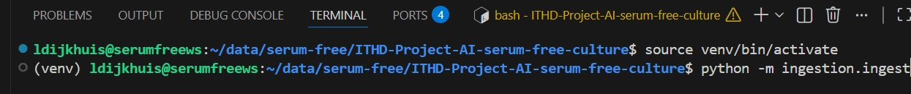
In the image above you can see in the terminal the environment was activated and the ingestion pipeline was started (called upon).

#### Optional flags:

```bash
# With verbose logging
python -m ingestion.ingest --verbose

# Skip knowledge graph (if Neo4j is not needed)
python -m ingestion.ingest --no-graph

# Clean existing data before ingesting
python -m ingestion.ingest --clean

# Use a different folder
python -m ingestion.ingest --documents /path/to/your/papers
```

#### Verify the paper was added:
```bash
curl http://localhost:8058/documents
```

> **Tip — Running ingestion in the background on the VM**
>
> Ingestion can take a long time. Use `screen` to keep it running even if your SSH session drops:
>
> ```bash
> # Start a named screen session
> screen -S <name_screen>
>
> # Run ingestion inside the session
> python -m ingestion.ingest --verbose
>
> # Detach from the session (keeps it running): press Ctrl + A, then D
>
> # List active sessions
> screen -ls
>
> # Reattach to a session
> screen -r ingest
>
> # Close a session completely (from inside it)
> exit
> ```

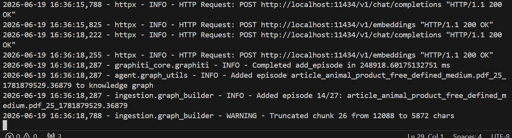
In the image above you see the terminal while the files are being ingested, chunked and embedded (mostly with graphiti).

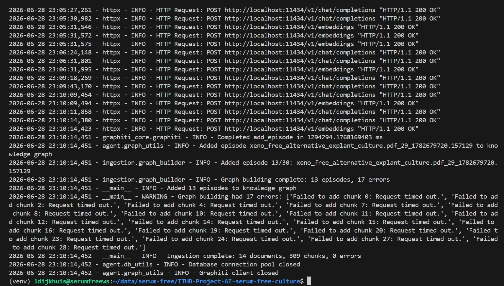
A screenshot of after the ingestion is done. 14 files were ingested (as in the screenshots). 

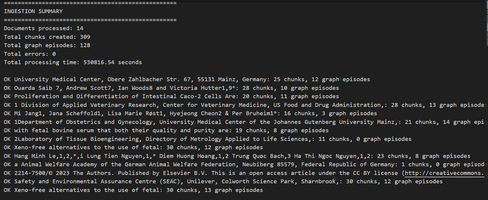
In the image above you see the ingestion summary that appears in the terminal after the ingestion of the files is done. The names of the files are shown with the amount of chunks and graph episodes created.

**Step 4 — Start the API server (Terminal 1)**

The API server runs in the foreground and must stay running to handle requests. Leave this terminal open.

```bash
python -m agent.api
```
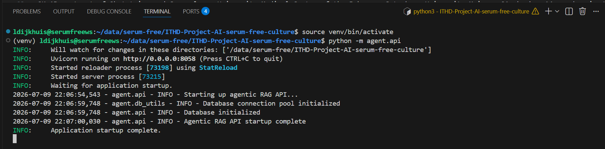
In the image above you see that agent.api is called using the command in the terminal. It shows that the application start-up is complete and ready.

**Step 5 — Verify the server is running**

```bash
curl http://localhost:8058/health
```

**Step 6 — Start the CLI chat (Terminal 2)**

Open a new terminal window, activate the environment, then start the CLI. The API server from Step 4 must already be running in the other terminal.

```bash
source venv/bin/activate
python cli.py
```

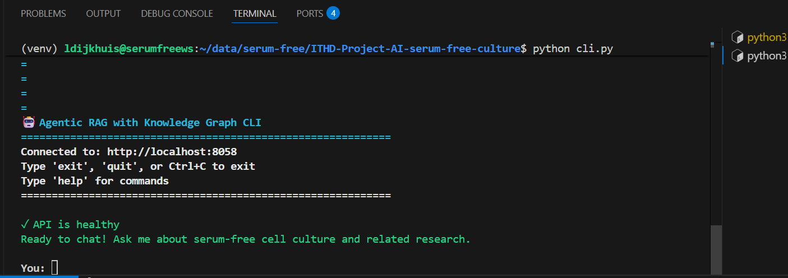
In the image above you see a new terminal window is opened and the CLI.py is called upon or the command is typed in the terminal. The CLI is opened and tells it is healthy and ready to be asked a question. 

---

### Available API Endpoints

| Method | Endpoint | Description |
|--------|----------|-------------|
| GET | `/health` | Check if the API and database are running |
| POST | `/chat` | Send a question to the agent |
| POST | `/chat/stream` | Streaming response via Server-Sent Events |
| POST | `/search/vector` | Direct vector similarity search |
| POST | `/search/hybrid` | Hybrid search (vector + keyword) |
| GET | `/documents` | List all ingested documents |

### Example Chat Request

```bash
curl -X POST http://localhost:8058/chat \
  -H "Content-Type: application/json" \
  -d '{"message": "What is the cell viability for the serum-free medium?"}'
```

---

## 4. Architecture

### 4.1 How the System Works

The diagram below shows the complete workflow of the application.

1. Research papers are placed in the `source_papers` folder.
2. The ingestion pipeline reads every PDF.
3. Each paper is split into logical scientific sections (IMRaD).
4. The sections are divided into smaller chunks.
5. Every chunk is converted into an embedding and stored inside PostgreSQL.
6. Graphiti extracts entities and relationships and stores them in Neo4j.
7. When a researcher asks a question, the AI agent searches the stored information.
8. The retrieved evidence is sent to the language model, which generates an answer containing references to the original papers.


## Ingestion Pipeline

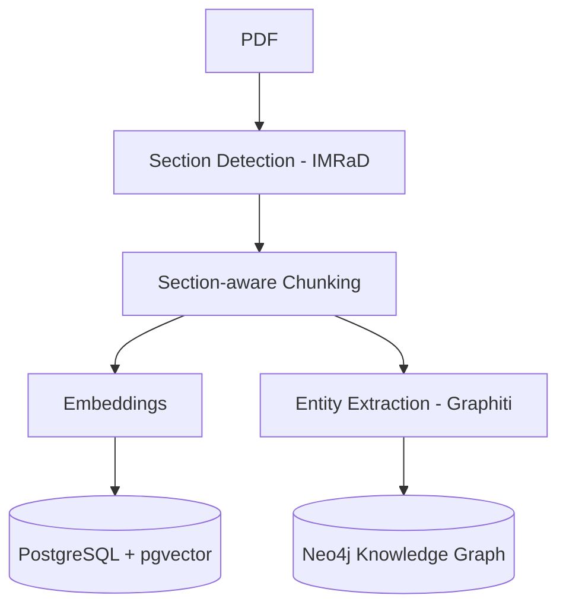


## Query Pipeline

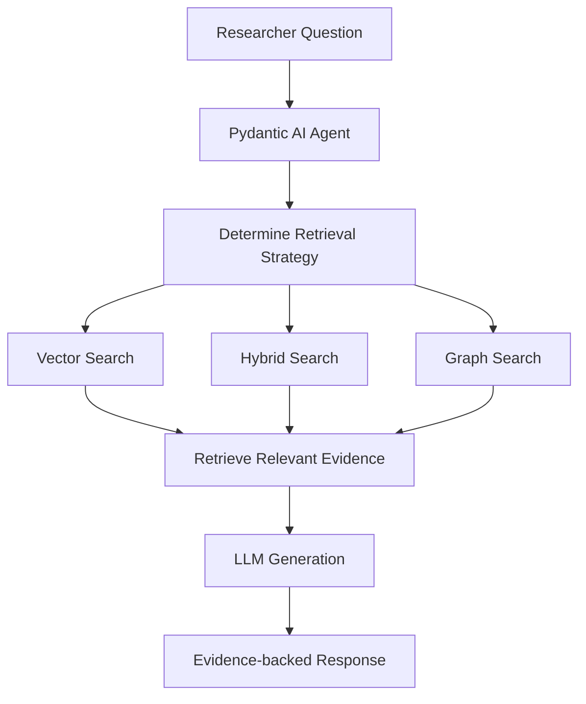

### 4.2 System Architecture Diagram

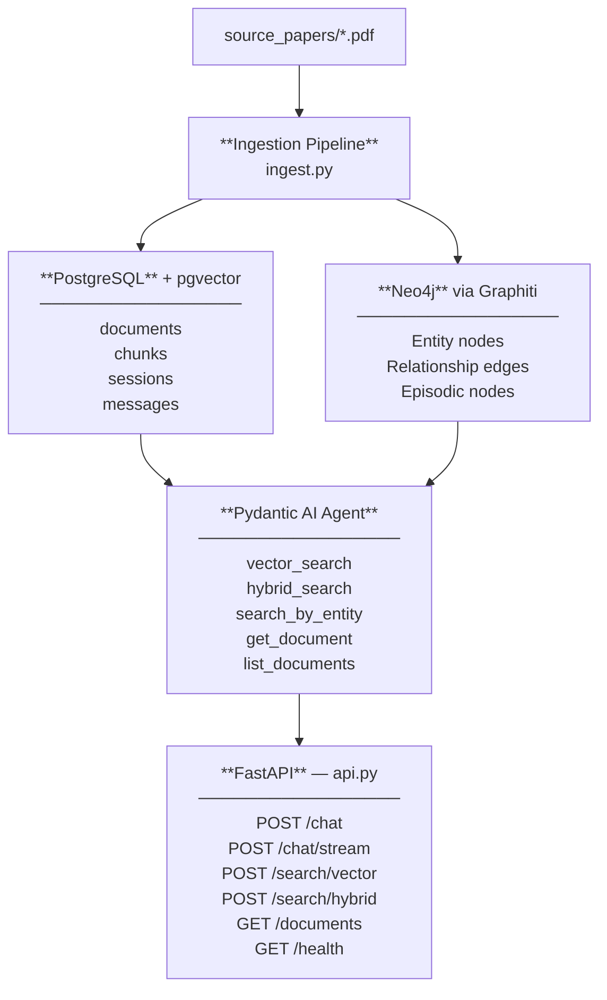

> **Note:** To render the diagram above, open this file in VS Code and press `Ctrl + Shift + V` to open Markdown Preview. Install the **Markdown Preview Mermaid Support** extension if the diagram does not appear.

---

## 5. Configuration Reference

All configuration is done through the `.env` file. Copy `example.env` to `.env` and fill in your values. The table below lists every variable, whether it is required, its default, and what it does.

### Database

| Variable | Required | Default | Description |
|----------|----------|---------|-------------|
| `DATABASE_URL` | Yes | — | Full Neon PostgreSQL connection string |

### LLM Provider

| Variable | Required | Default | Description |
|----------|----------|---------|-------------|
| `LLM_PROVIDER` | Yes | — | Provider name: `openai`, `ollama`, `gemini`, or `openrouter` |
| `LLM_BASE_URL` | Yes | — | API endpoint. See examples below |
| `LLM_API_KEY` | Yes | — | API key. Use `ollama` as the value for local Ollama |
| `LLM_CHOICE` | Yes | — | Model name, e.g. `qwen2.5:7b`, `qwen3:32b`, `gpt-4.1-mini`, `gemini-2.5-flash` |
| `INGESTION_LLM_CHOICE` | No | same as `LLM_CHOICE` | A separate (usually faster or cheaper) model used only during document ingestion |

**Provider base URL examples:**

| Provider | `LLM_BASE_URL` |
|----------|----------------|
| Ollama (local) | `http://localhost:11434/v1` |
| OpenAI | `https://api.openai.com/v1` |
| OpenRouter | `https://openrouter.ai/api/v1` |
| Gemini | `https://generativelanguage.googleapis.com/v1beta` |

### Embedding Model

| Variable | Required | Default | Description |
|----------|----------|---------|-------------|
| `EMBEDDING_PROVIDER` | Yes | — | Provider name: `openai`, `ollama`, or `gemini` |
| `EMBEDDING_BASE_URL` | Yes | — | API endpoint for the embedding model (same format as LLM) |
| `EMBEDDING_API_KEY` | Yes | — | API key for embeddings (can be the same as `LLM_API_KEY`) |
| `EMBEDDING_MODEL` | Yes | — | Model name, e.g. `nomic-embed-text`, `text-embedding-3-small` |
| `VECTOR_DIMENSION` | Yes | `768` | Must match the dimension of your embedding model. `768` for `nomic-embed-text`, `1536` for `text-embedding-3-small` |

### Neo4j Knowledge Graph

| Variable | Required | Default | Description |
|----------|----------|---------|-------------|
| `NEO4J_URI` | No | `bolt://localhost:7687` | Neo4j connection URI |
| `NEO4J_USER` | No | `neo4j` | Neo4j username |
| `NEO4J_PASSWORD` | No | — | Neo4j password (set during Neo4j setup). Required if Neo4j is used |

> If Neo4j is not configured, run ingestion with `--no-graph` to skip knowledge graph building.

### Application

| Variable | Required | Default | Description |
|----------|----------|---------|-------------|
| `APP_ENV` | No | `development` | Set to `production` to disable debug logging |
| `LOG_LEVEL` | No | `INFO` | Log verbosity: `DEBUG`, `INFO`, `WARNING`, or `ERROR` |
| `APP_PORT` | No | `8058` | Port on which the FastAPI server listens |

---

## 6. Known Limitations

The following limitations are known and may be addressed in future versions.

**Medium composition from tables**
Many papers list exact medium ingredients and concentrations in a table within the Methods section. The PDF reader extracts table content as a flat stream of text, which often results in garbled or missing data. When this happens, the agent will explicitly state: *"Medium composition was not fully captured from this paper. It may be in a table that could not be extracted."* It will not guess or fill in values from general knowledge.

**Knowledge graph not yet queryable by the agent**
The knowledge graph (Neo4j) is populated during ingestion, building a network of relationships between cell types, media suppliers, culture conditions, and outcomes. However, the AI agent does not yet have a tool to query this graph directly when answering questions. All agent answers currently come from the vector and hybrid search over PostgreSQL. Graph querying is planned for a future version.

**Scanned-image PDFs**
PDFs that consist of scanned images without a text layer (i.e. no embedded text, only a photo of the page) produce no output. The system requires PDFs with a proper text layer. If a paper produces no chunks after ingestion, this is the most likely cause.

**Author and journal name extraction**
The PDF parser extracts the title, DOI, and publication year from paper headers. Author names and journal names are not reliably extracted because their position and format vary too much between publishers. These fields may be absent from chunk metadata.

---

## Evaluation

The current implementation successfully demonstrates the technical feasibility of the retrieval pipeline.

Successfully implemented

- PDF ingestion
- Automatic chunking
- Embedding generation
- Vector search
- Hybrid retrieval
- Citation-based answers

Current limitations

- Tables cannot yet be extracted correctly
- Figures cannot be analysed
- Morphology images are ignored
- No structured comparison between papers
- Recommendations cannot yet be generated

The system therefore functions as an evidence retrieval assistant rather than a scientific recommendation system.

#### Examples 

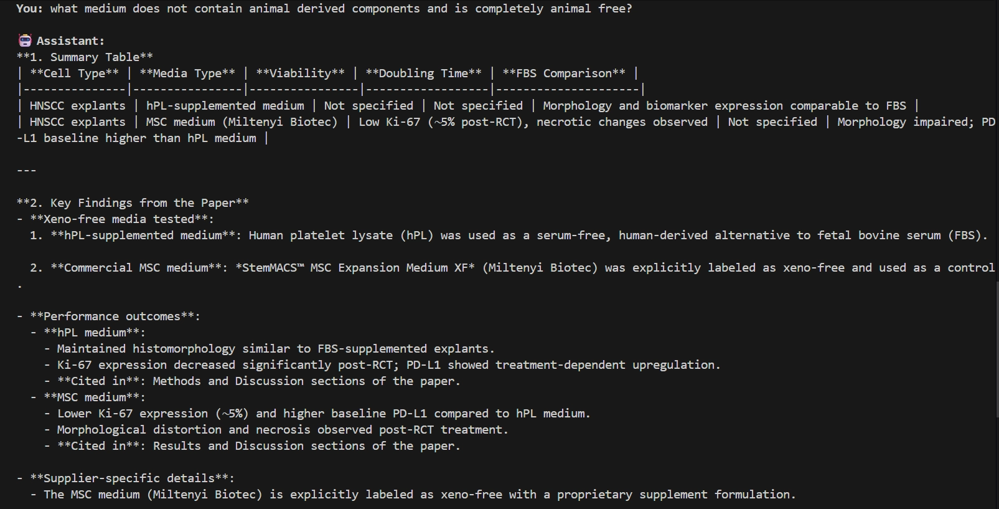
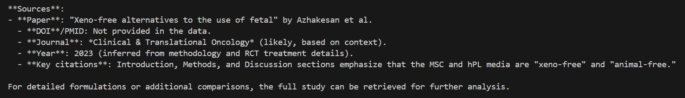

In the image above the agent was asked "what medium does not contain animal derived components and is completely animal free?". The agent gives the key findings of the paper and the outcomes of the medium on the cells. The sources of which paper the this information comes from was also given by the agent. 
---
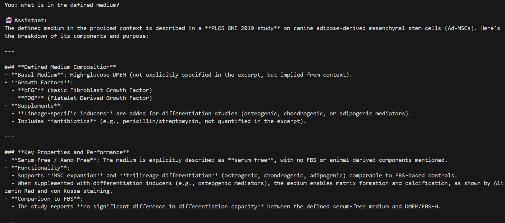
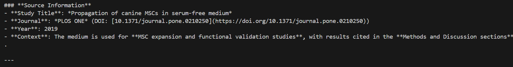
In the image above, the agent was asked "what is in the defined medium?". The agent uses one explicit paper to answer this question. The title and DOI of the paper is given.

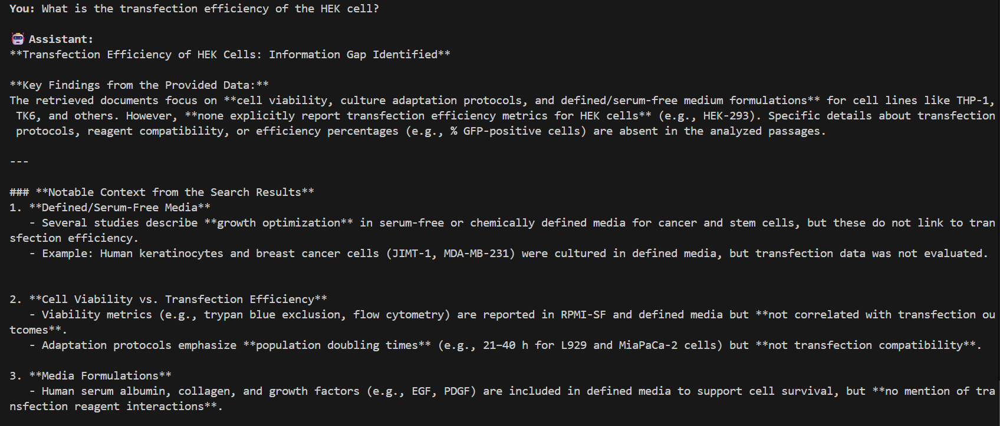
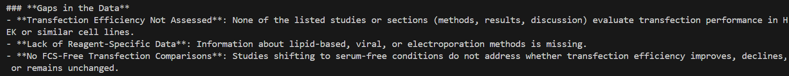
In the image above, the agent was asked "What is the transfection efficiency of the HEK cell?". The agent answers "Specific details about transfection protocols, reagent compatibility, or efficiency percentages (e.g., % GFP-positive cells) are absent in the analyzed passages.". The agent gives answer: "- **Transfection Efficiency Not Assessed**: None of the listed studies or sections (methods, results, discussion) evaluate transfection performance in HEK or similar cell lines."

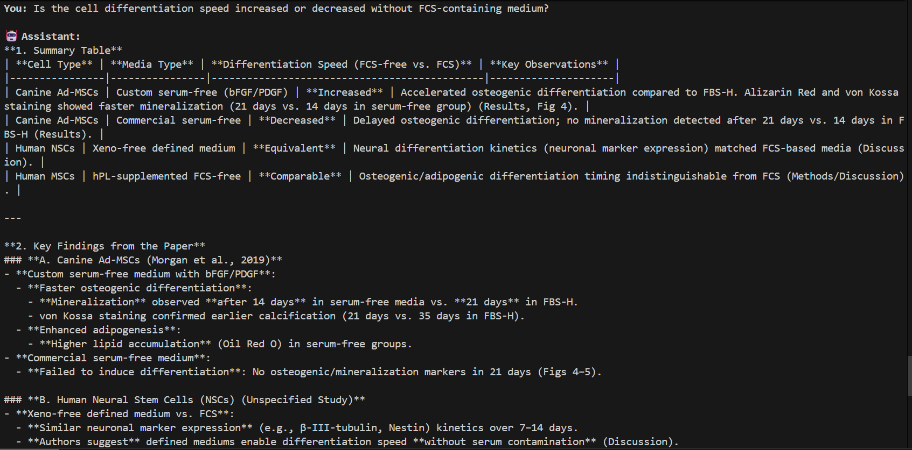
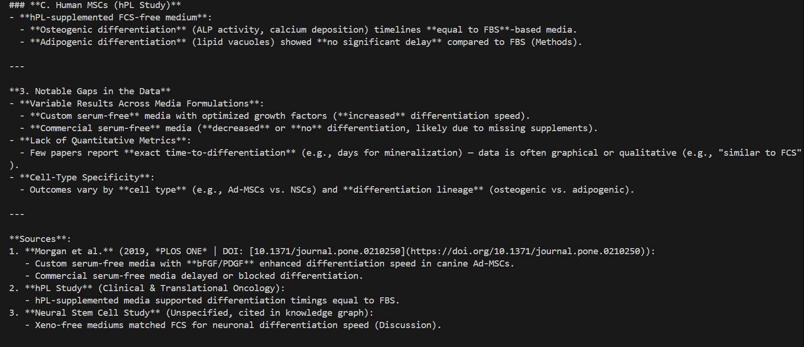
In the image above, the agent was asked "Is the cell differentiation speed increased or decreased without FCS-containing medium". The agent gives the key points of three papers that could answer the question asked. The sources of which paper the this information comes from was also given by the agent. 

## 7. Troubleshooting

### The API does not start

Check that the database connection is working:

```bash
psql "$DATABASE_URL" -c "SELECT 1;"
```

Check that the `.env` file exists and contains `DATABASE_URL`. If the file is missing or the variable is empty, the server will fail at startup.

### No results returned for a question

The most common cause is that ingestion has not been run yet. Run:

```bash
python -m ingestion.ingest --verbose
```

Confirm that documents are listed in the database:

```bash
curl http://localhost:8058/documents
```

### Neo4j connection errors at startup

If you are not using the knowledge graph, re-run ingestion with `--no-graph` and make sure `NEO4J_PASSWORD` is either removed from `.env` or left blank. Neo4j errors are non-fatal. Ingestion will continue without the graph if the connection fails.

### Ollama model not found

Make sure the model was pulled before running:

```bash
ollama pull nomic-embed-text
ollama pull qwen2.5:7b
```

List installed models to confirm:

```bash
ollama list
```

### Embedding dimension mismatch

If you see a database error mentioning vector dimensions, the `VECTOR_DIMENSION` in your `.env` does not match the model you selected. Check the table in [Section 5](#embedding-model) for the correct dimension, update `.env`, and re-run the database schema setup in `sql/schema.sql`.

### PDF produces no chunks after ingestion

The PDF likely has no text layer (scanned image). Open the PDF and try to select text. If you cannot, the file needs OCR processing before it can be ingested. This is not supported automatically.

---

## Support & Contact

For any questions about the domain-specific RAG (Retrieval-Augmented Generation) system, please contact:

| Name | Email |
|------|-------|
| Marc Teunis | marc.teunis@hu.nl |
| Bas van Gestel | bas.vangestel@hu.nl |
| Ronald Vlasblom | ronald.vlasblom@hu.nl |
